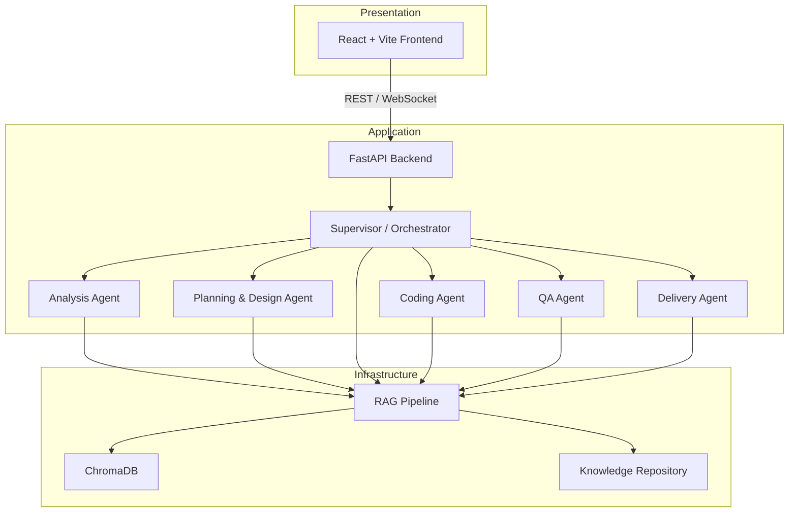
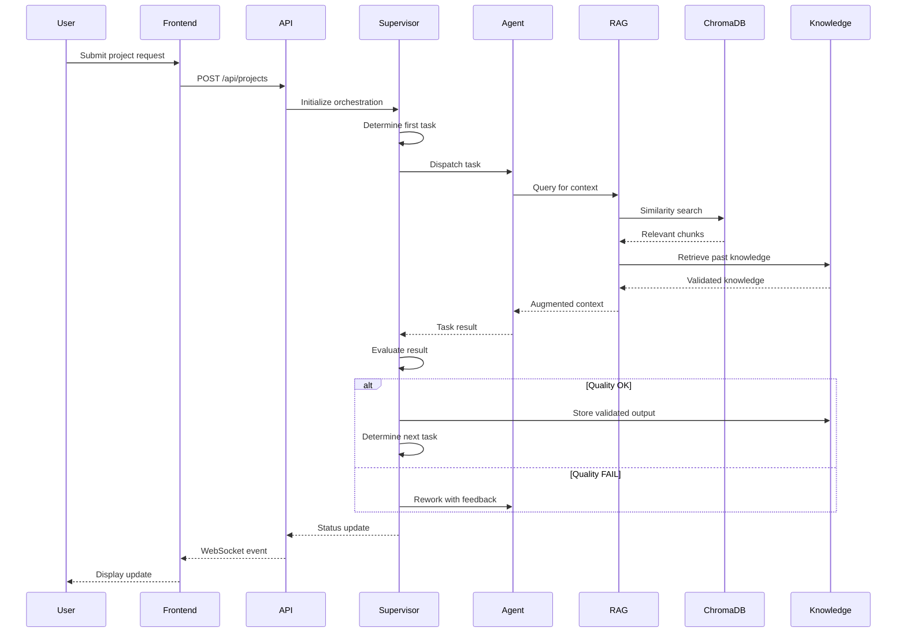
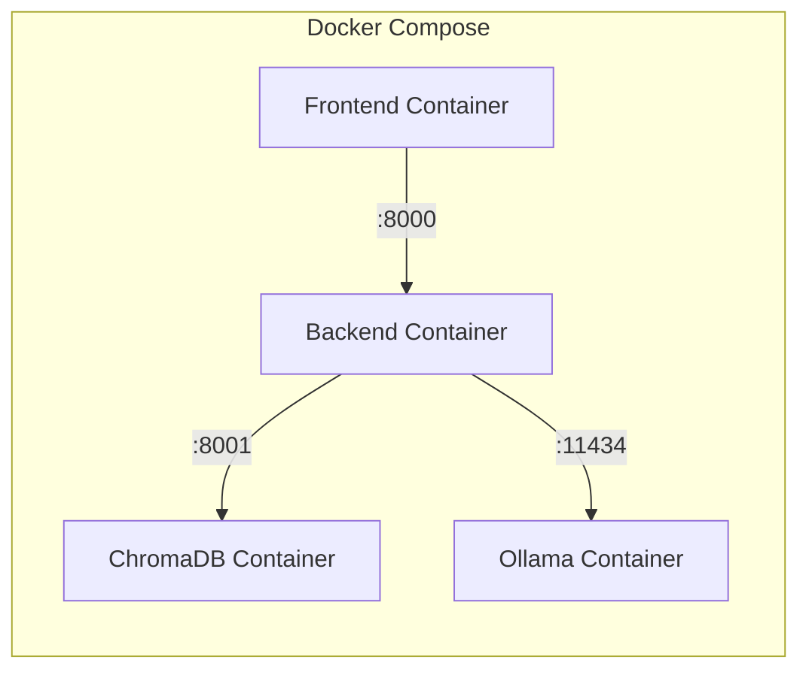

# 03 — Architecture

> **Document Status:** Initial Draft
> **Last Updated:** Phase 0

---

## 1. Architectural Overview

SEAM follows a **layered, modular architecture** with three primary tiers:

1. **Presentation Layer** — React + Vite frontend
2. **Application Layer** — FastAPI backend, orchestration engine, and agents
3. **Infrastructure Layer** — RAG pipeline, ChromaDB, Organizational Knowledge Repository



## 2. Design Principles

| Principle | Application in SEAM |
|-----------|-------------------|
| **Separation of Concerns** | Each agent handles one phase of the SE lifecycle |
| **Single Responsibility** | RAG is infrastructure, not an agent |
| **Loose Coupling** | Agents communicate through the Supervisor via structured messages |
| **High Cohesion** | Related functionality is grouped in dedicated packages |
| **Open for Extension** | New models, prompts, and knowledge can be added without code changes |
| **Fail Gracefully** | Agent failures are caught and handled by the Supervisor |

## 3. Component Architecture

### 3.1 Frontend (React + Vite)

- Single-page application
- Communicates with backend via REST API and WebSocket
- Displays project dashboard, agent activity feed, and generated artifacts

### 3.2 Backend (FastAPI)

- REST API endpoints for project CRUD, agent triggering, and artifact retrieval
- WebSocket endpoint for real-time status streaming
- Input validation via Pydantic models
- Middleware for logging, error handling, and CORS

### 3.3 Orchestration (LangGraph)

- State machine built with LangGraph
- Nodes represent agents; edges represent transitions and conditions
- The Supervisor evaluates agent outputs and decides the next step
- Supports cycles (e.g., QA failure → rework by Coding Agent)

### 3.4 Agents

Each agent follows a consistent structure:

```
agents/
├── __init__.py
├── base.py              # Abstract base agent class
├── analysis.py          # Analysis Agent
├── planning.py          # Planning & Design Agent
├── supervisor.py        # Supervisor/Orchestrator Agent
├── coding.py            # Coding Agent
├── qa.py                # QA Agent
└── delivery.py          # Delivery Agent
```

All agents:
- Inherit from `BaseAgent`
- Accept `AgentInput` (Pydantic model)
- Return `AgentOutput` (Pydantic model)
- Have access to the RAG service
- Are stateless (state is managed by the orchestrator)

### 3.5 RAG Infrastructure

```
rag/
├── __init__.py
├── chunker.py           # Document chunking strategies
├── embedder.py          # Embedding generation
├── retriever.py         # Similarity search interface
├── indexer.py           # Document indexing into ChromaDB
└── config.py            # RAG configuration
```

### 3.6 Knowledge Repository

```
knowledge/
├── __init__.py
├── repository.py        # CRUD operations for knowledge entries
├── validator.py         # Knowledge validation before storage
├── models.py            # Knowledge entry data models
└── data/                # Persisted knowledge files
```

#### Knowledge Versioning Strategy

The knowledge repository uses **metadata-based versioning**. Each knowledge
entry is stored in ChromaDB with the following metadata fields:

| Field | Description |
|-------|-------------|
| `knowledge_id` | Unique identifier for the knowledge entry |
| `version` | Integer version number, incremented on update |
| `created_at` | Timestamp of initial creation |
| `updated_at` | Timestamp of the most recent update |
| `source` | Originating project and task identifier |
| `domain` | Domain or category of the knowledge |
| `knowledge_type` | Type classification (e.g., code pattern, architecture pattern) |
| `validation_status` | Whether the entry has been validated (pending, validated, rejected) |

ChromaDB stores the vector embedding, document content, and metadata.
The repository layer (`repository.py`) manages version semantics: when
a knowledge entry is updated, a new version is created with an
incremented version number and updated timestamp. Previous versions
remain queryable by specifying version filters in metadata.

No separate database is introduced; all versioning is handled through
ChromaDB metadata fields and the repository abstraction layer.

### 3.7 Logging & Observability

Agent-level actions and decisions are recorded through the backend
observability layer. This is not a separate service or agent — it is an
integral part of the backend infrastructure (§3.2).

Each log event contains:

| Field | Description |
|-------|-------------|
| `agent_id` | Identifier of the agent producing the event |
| `task_id` | Identifier of the task being executed |
| `timestamp` | ISO-8601 timestamp of the event |
| `action_type` | Type of action (e.g., `execute`, `query_rag`, `evaluate`) |
| `execution_status` | Outcome of the action (e.g., `success`, `failure`, `timeout`) |
| `metadata` | Additional context (e.g., LLM model used, token count, duration) |

Logs serve three purposes:

1. **Debugging** — trace agent behaviour during development
2. **Traceability** — satisfy FR-1.5 and NFR-5.1 by recording all agent
   invocations with timestamps and trace IDs
3. **Evaluation** — provide data for performance metrics and experiment
   analysis (FR-7.2)

## 4. Data Flow



## 5. Technology Mapping

| Component | Technology | Rationale |
|-----------|-----------|-----------|
| Frontend | React + Vite | Fast development, modern tooling |
| Backend | FastAPI | Async support, auto-docs, Pydantic integration |
| Orchestration | LangGraph | Native support for agent graphs with cycles |
| LLM Inference | Ollama | Local inference, no cloud dependency |
| Code Model | DeepSeek-Coder | Strong code generation capability |
| General Model | Llama 3.1 | Good reasoning and instruction following |
| Vector Store | ChromaDB | Lightweight, Python-native, persistent |
| Data Validation | Pydantic | Type-safe, auto-serialization |

## 6. Deployment Architecture



## 7. Key Architectural Decisions

| Decision | Rationale |
|----------|-----------|
| RAG as shared infrastructure | Avoids an unnecessary seventh agent; RAG is a utility |
| LangGraph for orchestration | Supports cyclic graphs needed for QA-rework loops |
| Local LLMs via Ollama | Reproducibility, privacy, no API costs |
| Stateless agents | Simplifies testing and allows orchestrator to manage all state |
| Pydantic everywhere | Consistent data validation across API, agents, and knowledge |
