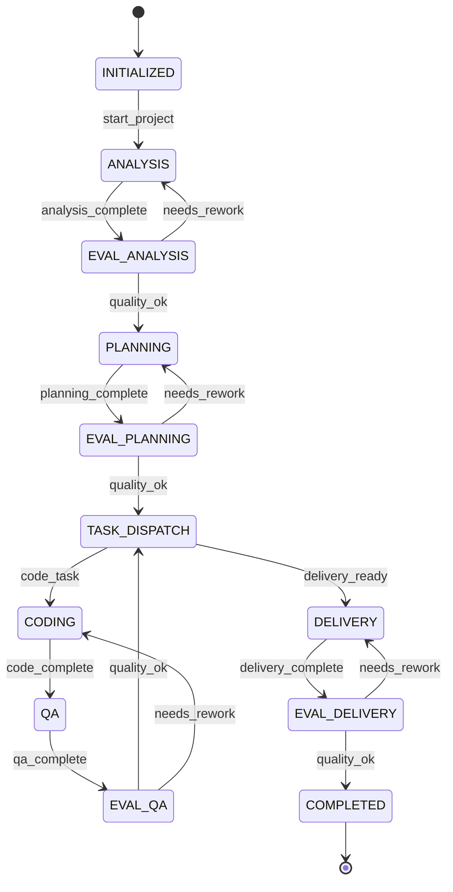
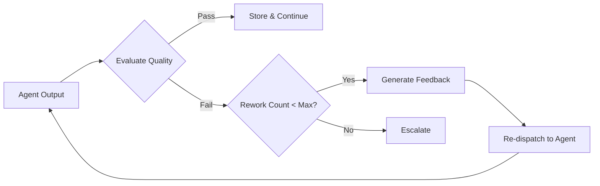

# 05 — Supervisor Algorithm

> **Document Status:** Initial Draft
> **Last Updated:** Phase 0

---

## 1. Overview

The Supervisor/Orchestrator is the central coordination agent in SEAM. Unlike a
static sequential pipeline, the Supervisor uses a **state machine** (built with
LangGraph) that supports:

1. **Dynamic task assignment** — routing tasks to the appropriate agent
2. **Dependency checking** — ensuring prerequisites are met before dispatch
3. **Intermediate-result evaluation** — assessing agent outputs
4. **QA-driven rework** — cycling back when quality is insufficient

## 2. State Machine Design



## 3. Orchestration States

| State | Description |
|-------|-------------|
| `INITIALIZED` | Project received, ready to begin |
| `ANALYSIS` | Analysis Agent is processing requirements |
| `EVAL_ANALYSIS` | Supervisor evaluates analysis output |
| `PLANNING` | Planning & Design Agent is producing architecture |
| `EVAL_PLANNING` | Supervisor evaluates planning output |
| `TASK_DISPATCH` | Supervisor selects the next task from the dependency graph |
| `CODING` | Coding Agent is generating code for a task |
| `QA` | QA Agent is validating the coding output |
| `EVAL_QA` | Supervisor evaluates QA report and decides pass/rework |
| `DELIVERY` | Delivery Agent is preparing final artifacts |
| `EVAL_DELIVERY` | Supervisor evaluates delivery output |
| `COMPLETED` | All tasks done, project finished |

## 4. Decision Logic

### 4.1 Task Assignment Algorithm

```
function assign_next_task(state):
    pending_tasks = get_tasks_with_status(PENDING)
    for task in pending_tasks (sorted by priority):
        if all_dependencies_met(task):
            return dispatch(task, select_agent(task.type))
    if no pending_tasks:
        return transition_to(DELIVERY)
    else:
        return WAIT  # dependencies not yet met
```

### 4.2 Quality Evaluation Algorithm

```
function evaluate_output(agent_output, quality_criteria):
    score = assess_quality(agent_output, quality_criteria)
    if score >= QUALITY_THRESHOLD:
        store_validated_knowledge(agent_output)
        return PASS
    elif rework_count < MAX_REWORK_ATTEMPTS:
        feedback = generate_rework_feedback(agent_output, quality_criteria)
        return REWORK(feedback)
    else:
        return ESCALATE  # flag for human review
```

### 4.3 Rework Cycle



## 5. Configurable Parameters

| Parameter | Default | Description |
|-----------|---------|-------------|
| `QUALITY_THRESHOLD` | 0.7 | Minimum score for an output to pass |
| `MAX_REWORK_ATTEMPTS` | 3 | Maximum rework cycles before escalation |
| `TASK_TIMEOUT` | 120s | Maximum time for an agent to complete a task |
| `EVALUATION_MODEL` | llama3.1 | LLM used for quality evaluation |

## 6. LangGraph Integration

The state machine will be implemented as a LangGraph `StateGraph`:

```python
from langgraph.graph import StateGraph, END

workflow = StateGraph(SupervisorState)

# Add nodes
workflow.add_node("analysis", analysis_node)
workflow.add_node("eval_analysis", eval_analysis_node)
workflow.add_node("planning", planning_node)
workflow.add_node("eval_planning", eval_planning_node)
workflow.add_node("task_dispatch", task_dispatch_node)
workflow.add_node("coding", coding_node)
workflow.add_node("qa", qa_node)
workflow.add_node("eval_qa", eval_qa_node)
workflow.add_node("delivery", delivery_node)
workflow.add_node("eval_delivery", eval_delivery_node)

# Add edges with conditions
workflow.add_edge("analysis", "eval_analysis")
workflow.add_conditional_edges("eval_analysis", route_after_eval, {...})
# ... more edges

workflow.set_entry_point("analysis")
app = workflow.compile()
```

## 7. State Schema

```python
class SupervisorState(TypedDict):
    project_id: str
    current_phase: str
    task_graph: dict           # Tasks with dependencies
    completed_tasks: list[str]
    current_task: str | None
    agent_outputs: dict        # task_id -> AgentOutput
    rework_counts: dict        # task_id -> int
    quality_scores: dict       # task_id -> float
    messages: list             # Communication log
    final_artifacts: list
```

## 8. Future Enhancements

- **Parallel task dispatch**: When independent tasks are identified, dispatch
  them concurrently.
- **Adaptive thresholds**: Adjust quality thresholds based on task type and
  historical performance.
- **Human-in-the-loop**: Allow the Supervisor to pause and request human
  input for ambiguous decisions.
