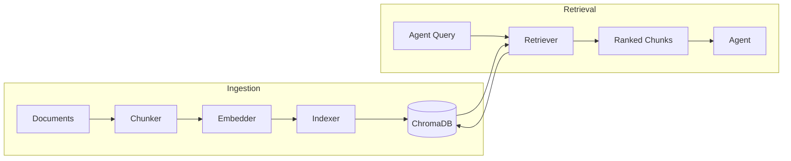
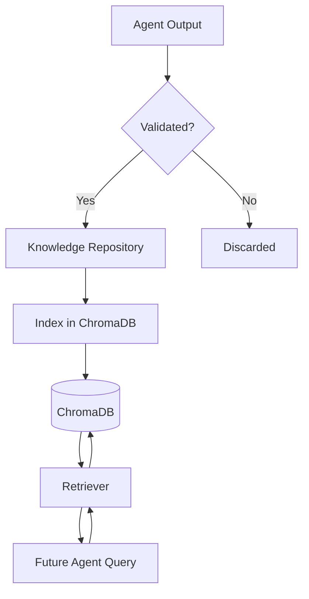

# 06 — RAG Architecture

> **Document Status:** Initial Draft
> **Last Updated:** Phase 0

---

## 1. Overview

Retrieval-Augmented Generation (RAG) is a **shared infrastructure service** in
SEAM — not an independent agent. It provides all six agents with the ability to
retrieve relevant context from the document corpus and organizational knowledge
repository before generating their outputs.

## 2. Why RAG as Shared Infrastructure

| Alternative | Issue |
|------------|-------|
| RAG as a seventh agent | Violates the six-agent constraint; adds unnecessary orchestration overhead |
| No RAG (pure LLM) | LLMs hallucinate without grounding; domain context is essential |
| RAG per agent | Code duplication; inconsistent retrieval behaviour |
| **Shared RAG service** | **Single codebase; consistent retrieval; accessible to all agents** |

## 3. RAG Pipeline Architecture



## 4. Components

### 4.1 Chunker (`rag/chunker.py`)

Splits documents into chunks suitable for embedding and retrieval.

| Parameter | Default | Description |
|-----------|---------|-------------|
| `chunk_size` | 512 tokens | Maximum tokens per chunk |
| `chunk_overlap` | 50 tokens | Overlap between consecutive chunks |
| `strategy` | `recursive` | Chunking strategy (recursive, sentence, paragraph) |

Strategies:
- **Recursive**: Splits on natural boundaries (paragraphs → sentences → words)
- **Sentence**: One chunk per sentence
- **Paragraph**: One chunk per paragraph

### 4.2 Embedder (`rag/embedder.py`)

Generates vector embeddings for text chunks.

- Uses the embedding model available via Ollama
- Embeddings are stored alongside chunks in ChromaDB
- Supports batch embedding for ingestion performance

### 4.3 Indexer (`rag/indexer.py`)

Manages the ingestion pipeline: chunk → embed → store in ChromaDB.

- Creates and manages ChromaDB collections
- Supports incremental indexing (add new documents without re-indexing)
- Stores metadata alongside each chunk (source file, timestamp, type)

### 4.4 Retriever (`rag/retriever.py`)

Handles similarity search queries from agents.

| Parameter | Default | Description |
|-----------|---------|-------------|
| `top_k` | 5 | Number of results to return |
| `similarity_threshold` | 0.7 | Minimum similarity score |
| `include_metadata` | true | Whether to return chunk metadata |

### 4.5 Configuration (`rag/config.py`)

Centralised configuration loaded from environment variables.

## 5. ChromaDB Collection Design

| Collection | Contents | Used By |
|-----------|----------|---------|
| `project_docs` | Current project documents and requirements | Analysis, Planning |
| `code_patterns` | Code snippets and patterns | Coding, QA |
| `architecture` | Architecture decisions and designs | Planning, Coding |
| `validated_knowledge` | Past validated outputs | All agents |

## 6. Data Flow: Agent → RAG → Response

```python
# Pseudocode: How an agent uses RAG
async def execute(self, input: AgentInput) -> AgentOutput:
    # 1. Build the query from the task context
    query = self.build_query(input)

    # 2. Retrieve relevant context via RAG
    context_chunks = await self.rag_service.retrieve(
        query=query,
        collection="validated_knowledge",
        top_k=5
    )

    # 3. Build the prompt with retrieved context
    prompt = self.build_prompt(input, context_chunks)

    # 4. Call the LLM
    response = await self.llm.generate(prompt)

    # 5. Return structured output
    return self.parse_output(response)
```

## 7. Knowledge Integration

The RAG service also connects to the **Organizational Knowledge Repository**:

- Validated outputs from completed tasks are stored as knowledge entries
- These entries are indexed in ChromaDB for future retrieval
- This implements **continuous learning without LLM retraining**



## 8. Performance Considerations

- **Batch ingestion**: Embed and index documents in batches to reduce overhead
- **Collection partitioning**: Separate collections by knowledge type for faster queries
- **Caching**: Cache frequent queries to reduce ChromaDB load
- **Chunk size tuning**: Balance between context richness and retrieval precision
