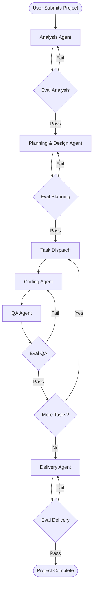
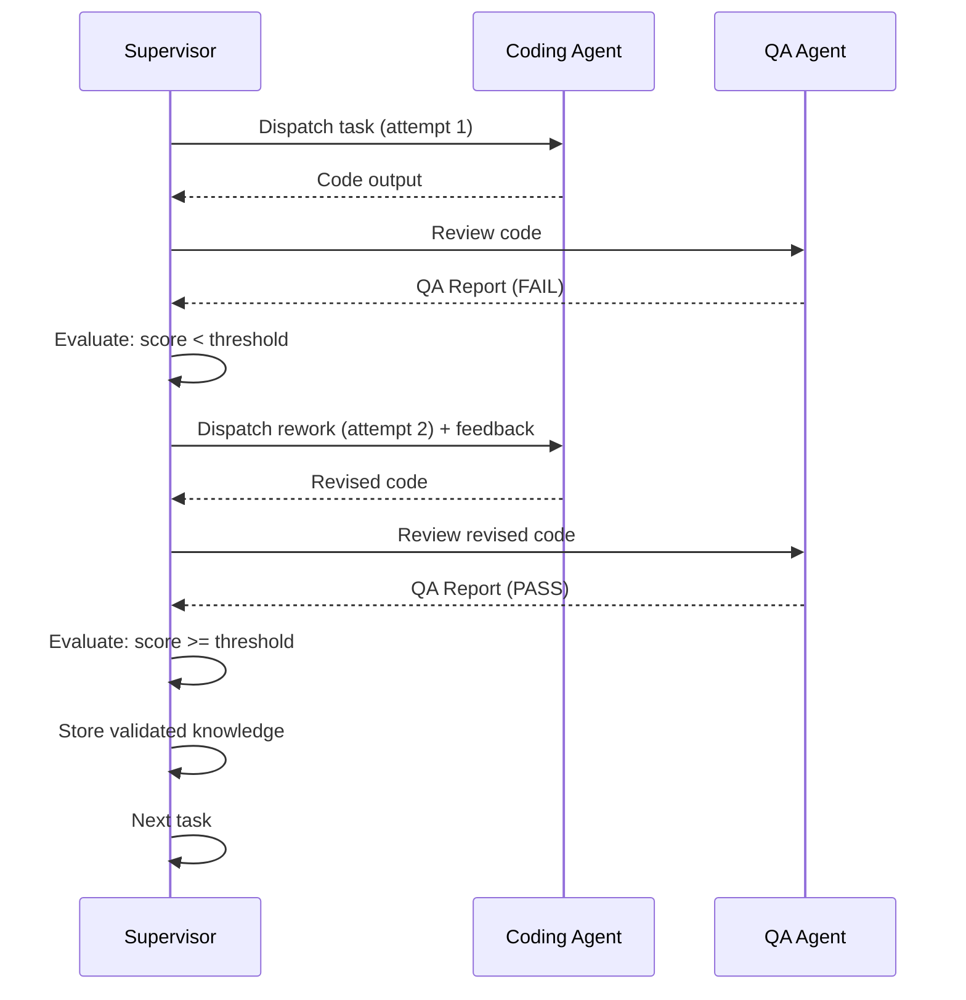

# 07 — Workflow

> **Document Status:** Initial Draft
> **Last Updated:** Phase 0

---

## 1. End-to-End Workflow

The SEAM workflow is **not a static sequential pipeline**. The Supervisor
dynamically determines the next step based on the current state, dependencies,
and quality evaluations. However, the typical (happy-path) flow follows this
progression:



## 2. Phase Descriptions

### Phase 1: Requirements Analysis

1. User submits a natural-language project description
2. The Supervisor dispatches the request to the **Analysis Agent**
3. The Analysis Agent queries RAG for similar past requirements
4. The Analysis Agent produces structured requirements
5. The Supervisor evaluates the quality of the requirements

### Phase 2: Planning & Design

1. The Supervisor dispatches structured requirements to the **Planning & Design Agent**
2. The Planning Agent queries RAG for architectural patterns
3. The Planning Agent produces an architecture and task dependency graph
4. The Supervisor evaluates the design quality

### Phase 3: Code Generation (Iterative)

1. The Supervisor selects the next ready task from the dependency graph
2. The Supervisor dispatches the task to the **Coding Agent**
3. The Coding Agent queries RAG for relevant code patterns
4. The Coding Agent generates code
5. The Supervisor dispatches the code to the **QA Agent**
6. The QA Agent tests and reviews the code
7. The Supervisor evaluates the QA report
8. If quality passes, the task is marked complete; otherwise, rework
9. Repeat until all tasks are complete

### Phase 4: Delivery

1. All coding tasks have passed QA
2. The Supervisor dispatches to the **Delivery Agent**
3. The Delivery Agent packages code, generates docs, and creates deployment configs
4. The Supervisor evaluates the delivery output
5. Project is marked complete

## 3. Rework Cycle Detail



## 4. Data Artifacts at Each Phase

| Phase | Input Artifacts | Output Artifacts |
|-------|----------------|-----------------|
| Analysis | Raw project description | Structured requirements, domain entities |
| Planning | Structured requirements | Architecture doc, task graph, tech recommendations |
| Coding | Task specification, code context | Source code files, change summary |
| QA | Generated code, requirements | Test results, review findings, quality score |
| Delivery | Validated code, project docs | Packaged app, user docs, deployment configs |

## 5. Real-Time Status Updates

Throughout the workflow, the Supervisor sends status updates to the
frontend via WebSocket:

```json
{
  "project_id": "proj-001",
  "phase": "CODING",
  "current_task": "task-003",
  "progress": 0.45,
  "agent": "coding",
  "status": "in_progress",
  "message": "Generating authentication module..."
}
```
