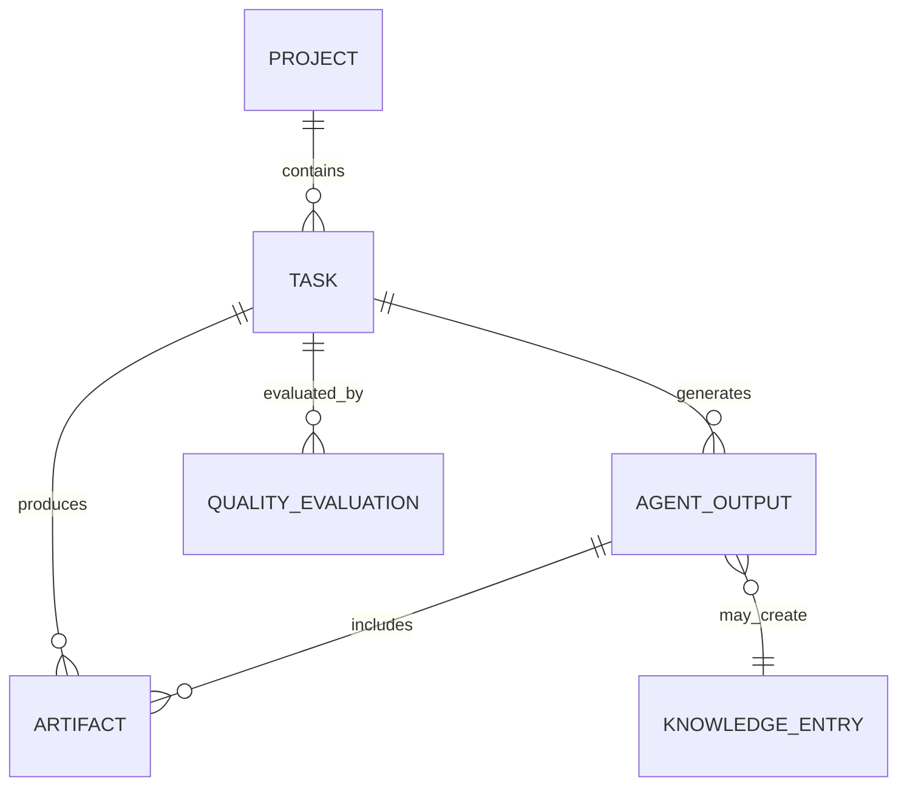

# 09 — Data Models

> **Document Status:** Initial Draft
> **Last Updated:** Phase 0

---

## 1. Overview

All data models in SEAM are defined using **Pydantic v2** for type safety,
validation, and serialization. Models are organized by domain.

## 2. Core Models

### 2.1 Project

```python
class ProjectCreate(BaseModel):
    name: str = Field(..., min_length=1, max_length=200)
    description: str = Field(..., min_length=10)
    technology_preferences: list[str] = []
    constraints: list[str] = []

class Project(BaseModel):
    id: str
    name: str
    description: str
    status: ProjectStatus
    technology_preferences: list[str] = []
    constraints: list[str] = []
    created_at: datetime
    updated_at: datetime | None = None
    completed_at: datetime | None = None

class ProjectStatus(str, Enum):
    CREATED = "created"
    RUNNING = "running"
    PAUSED = "paused"
    COMPLETED = "completed"
    FAILED = "failed"
```

### 2.2 Task

```python
class Task(BaseModel):
    id: str
    project_id: str
    title: str
    description: str
    type: TaskType
    status: TaskStatus
    priority: int = 0
    dependencies: list[str] = []
    assigned_agent: str | None = None
    input_data: dict[str, Any] = {}
    output_data: dict[str, Any] = {}
    rework_count: int = 0
    quality_score: float | None = None
    created_at: datetime
    completed_at: datetime | None = None

class TaskType(str, Enum):
    ANALYSIS = "analysis"
    PLANNING = "planning"
    CODING = "coding"
    QA = "qa"
    DELIVERY = "delivery"

class TaskStatus(str, Enum):
    PENDING = "pending"
    IN_PROGRESS = "in_progress"
    COMPLETED = "completed"
    FAILED = "failed"
    REWORK = "rework"
```

### 2.3 Agent I/O

```python
class AgentInput(BaseModel):
    task_id: str
    task_type: TaskType
    context: dict[str, Any]
    instructions: str
    dependencies: list[str] = []
    rework_feedback: str | None = None
    metadata: dict[str, Any] = {}

class AgentOutput(BaseModel):
    task_id: str
    agent_id: str
    status: Literal["success", "partial", "failure"]
    result: dict[str, Any]
    artifacts: list[Artifact] = []
    confidence: float = Field(default=0.0, ge=0.0, le=1.0)
    feedback: str = ""
    execution_time_ms: int = 0
    metadata: dict[str, Any] = {}
```

### 2.4 Artifact

```python
class Artifact(BaseModel):
    id: str
    project_id: str
    task_id: str
    type: ArtifactType
    name: str
    content: str
    language: str | None = None  # for code artifacts
    created_at: datetime

class ArtifactType(str, Enum):
    CODE = "code"
    DOCUMENT = "document"
    TEST = "test"
    CONFIG = "config"
    DIAGRAM = "diagram"
```

### 2.5 Knowledge Entry

```python
class KnowledgeEntry(BaseModel):
    id: str
    source_project_id: str
    source_task_id: str
    type: KnowledgeType
    title: str
    content: str
    tags: list[str] = []
    quality_score: float = Field(ge=0.0, le=1.0)
    validated: bool = False
    created_at: datetime
    accessed_count: int = 0

class KnowledgeType(str, Enum):
    REQUIREMENT_PATTERN = "requirement_pattern"
    ARCHITECTURE_PATTERN = "architecture_pattern"
    CODE_PATTERN = "code_pattern"
    TEST_PATTERN = "test_pattern"
    LESSON_LEARNED = "lesson_learned"
```

## 3. Orchestration Models

### 3.1 Supervisor State

```python
class SupervisorState(TypedDict):
    project_id: str
    current_phase: str
    task_graph: dict[str, Task]
    completed_tasks: list[str]
    current_task_id: str | None
    agent_outputs: dict[str, AgentOutput]
    rework_counts: dict[str, int]
    quality_scores: dict[str, float]
    messages: list[dict]
    final_artifacts: list[Artifact]
```

### 3.2 Quality Evaluation

```python
class QualityEvaluation(BaseModel):
    task_id: str
    evaluator: str
    score: float = Field(ge=0.0, le=1.0)
    passed: bool
    findings: list[str] = []
    recommendations: list[str] = []
    evaluated_at: datetime
```

## 4. RAG Models

```python
class RAGQuery(BaseModel):
    query: str
    collection: str = "validated_knowledge"
    top_k: int = Field(default=5, ge=1, le=20)
    similarity_threshold: float = Field(default=0.7, ge=0.0, le=1.0)

class RAGResult(BaseModel):
    chunks: list[RAGChunk]
    query_time_ms: int

class RAGChunk(BaseModel):
    content: str
    similarity_score: float
    metadata: dict[str, Any]
    source: str
```

## 5. API Response Wrappers

```python
class APIResponse(BaseModel, Generic[T]):
    success: bool = True
    data: T
    message: str = ""

class APIError(BaseModel):
    code: str
    message: str
    details: list[dict[str, str]] = []

class PaginatedResponse(BaseModel, Generic[T]):
    items: list[T]
    total: int
    page: int
    page_size: int
    has_next: bool
```

## 6. Model Relationships


