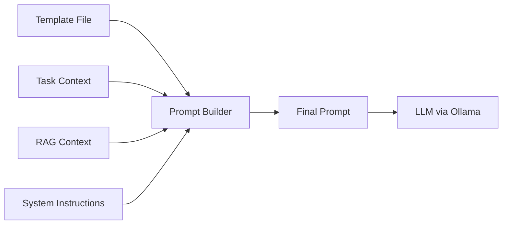

# 10 — Prompt Engineering

> **Document Status:** Initial Draft
> **Last Updated:** Phase 0

---

## 1. Overview

Prompt engineering is critical to SEAM's effectiveness. Each agent uses
carefully designed prompt templates that are:

- **Externalized** — stored in the `prompts/` directory, not hardcoded
- **Versioned** — tracked in version control
- **Parameterized** — use template variables filled at runtime
- **Augmented** — enriched with RAG-retrieved context

## 2. Prompt Architecture



## 3. Prompt Template Structure

Each prompt template follows a consistent structure:

```
SYSTEM: {system_instructions}

CONTEXT:
{rag_context}

TASK:
{task_description}

INSTRUCTIONS:
{specific_instructions}

CONSTRAINTS:
{constraints}

OUTPUT FORMAT:
{output_format_specification}

{few_shot_examples (optional)}
```

## 4. Agent-Specific Prompt Templates

### 4.1 Analysis Agent Prompt

**File:** `prompts/analysis_agent.yaml`

```yaml
name: analysis_agent
version: "1.0"
model: llama3.1
template: |
  SYSTEM:
  You are a senior software requirements analyst. Your task is to extract,
  clarify, and structure software requirements from the given project
  description. Be thorough, identify ambiguities, and make explicit any
  assumptions.

  CONTEXT FROM KNOWLEDGE BASE:
  {rag_context}

  PROJECT DESCRIPTION:
  {project_description}

  INSTRUCTIONS:
  1. Extract functional requirements
  2. Extract non-functional requirements
  3. Identify domain entities and relationships
  4. Flag any ambiguities or missing information
  5. List assumptions you are making

  OUTPUT FORMAT:
  Respond in JSON with the following structure:
  {output_schema}
```

### 4.2 Planning & Design Agent Prompt

**File:** `prompts/planning_agent.yaml`

*(Similar structure, focused on architecture and task decomposition)*

### 4.3 Supervisor Evaluation Prompt

**File:** `prompts/supervisor_eval.yaml`

*(Used when the Supervisor evaluates agent outputs for quality)*

### 4.4 Coding Agent Prompt

**File:** `prompts/coding_agent.yaml`

*(Focused on code generation with architecture constraints)*

### 4.5 QA Agent Prompt

**File:** `prompts/qa_agent.yaml`

*(Focused on test generation, code review, and quality assessment)*

### 4.6 Delivery Agent Prompt

**File:** `prompts/delivery_agent.yaml`

*(Focused on packaging, documentation generation, and deployment)*

## 5. Prompt Management Strategy

| Strategy | Description |
|----------|-------------|
| **Template Variables** | Use `{variable}` placeholders filled at runtime |
| **YAML Storage** | Prompts stored as YAML for structured metadata |
| **Version Tracking** | Each template has a `version` field |
| **A/B Testing** | Multiple template versions can coexist for experiments |
| **RAG Augmentation** | Retrieved context is injected into the `{rag_context}` slot |

## 6. Prompt Optimization Process

1. **Baseline**: Start with a well-structured initial prompt
2. **Evaluate**: Run the prompt against test inputs and measure output quality
3. **Iterate**: Adjust instructions, examples, and format specifications
4. **Document**: Record what changed and why in the version field
5. **Validate**: Re-run evaluation to confirm improvement

## 7. Output Format Enforcement

All prompts request structured JSON output to ensure parseability:

```python
# Pseudocode: Parsing agent output
response = await llm.generate(prompt)
try:
    parsed = json.loads(response)
    output = AgentOutput.model_validate(parsed)
except (json.JSONDecodeError, ValidationError) as e:
    # Retry with format correction prompt
    retry_prompt = f"Your previous output was not valid JSON: {e}. Please fix."
    response = await llm.generate(retry_prompt)
```

## 8. Few-Shot Examples

Where beneficial, prompts include few-shot examples to guide the LLM:

```yaml
examples:
  - input: "Build a todo app with user authentication"
    output: |
      {
        "functional_requirements": [...],
        "non_functional_requirements": [...],
        "entities": [...]
      }
```

## 9. Directory Structure

```
prompts/
├── __init__.py
├── analysis_agent.yaml
├── planning_agent.yaml
├── supervisor_eval.yaml
├── coding_agent.yaml
├── qa_agent.yaml
├── delivery_agent.yaml
├── rework_feedback.yaml
└── knowledge_validation.yaml
```
