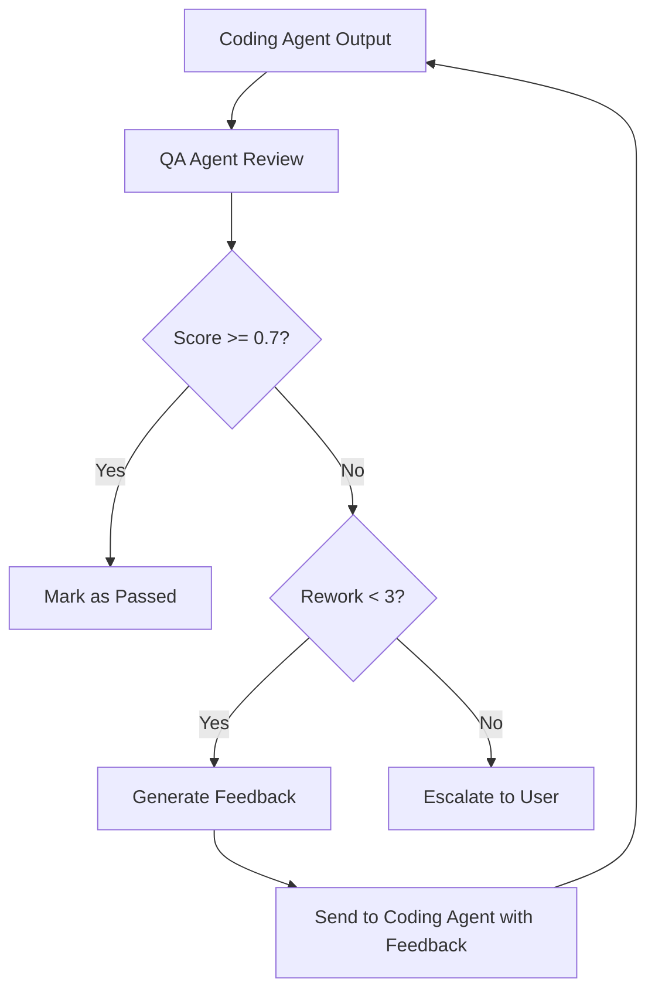

# 11 — QA Strategy

> **Document Status:** Initial Draft
> **Last Updated:** Phase 0

---

## 1. Overview

Quality Assurance in SEAM operates at two levels:

1. **Agent-Level QA** — The QA Agent validates outputs from the Coding Agent
2. **System-Level QA** — The Supervisor evaluates outputs from ALL agents

This document describes both levels and the QA-driven rework mechanism.

## 2. QA Agent Responsibilities

The QA Agent performs the following on code generated by the Coding Agent:

| Activity | Description |
|----------|-------------|
| **Unit Test Generation** | Generate unit tests for the produced code |
| **Test Execution** | Run generated tests and report results |
| **Static Analysis** | Check for common code smells and anti-patterns |
| **Code Review** | Evaluate code quality, readability, and adherence to conventions |
| **Requirements Tracing** | Verify that code addresses the specified requirements |
| **Quality Scoring** | Assign a composite quality score (0.0 – 1.0) |

## 3. Quality Dimensions

| Dimension | Weight | Measurement |
|-----------|--------|-------------|
| **Correctness** | 30% | Tests pass, logic matches requirements |
| **Completeness** | 25% | All required features implemented |
| **Code Quality** | 20% | Readability, naming, structure |
| **Documentation** | 10% | Inline comments, docstrings |
| **Security** | 10% | No obvious vulnerabilities |
| **Performance** | 5% | No obviously inefficient patterns |

## 4. Quality Score Calculation

```python
quality_score = (
    correctness * 0.30 +
    completeness * 0.25 +
    code_quality * 0.20 +
    documentation * 0.10 +
    security * 0.10 +
    performance * 0.05
)
```

## 5. QA-Driven Rework Flow



## 6. QA Report Format

```json
{
  "task_id": "task-003",
  "quality_score": 0.65,
  "passed": false,
  "dimensions": {
    "correctness": 0.7,
    "completeness": 0.5,
    "code_quality": 0.8,
    "documentation": 0.6,
    "security": 0.7,
    "performance": 0.8
  },
  "test_results": {
    "total": 10,
    "passed": 7,
    "failed": 3
  },
  "findings": [
    "Missing error handling in user registration endpoint",
    "No input validation for email field"
  ],
  "recommendations": [
    "Add try/except blocks around database operations",
    "Add Pydantic email validator"
  ]
}
```

## 7. Supervisor Quality Evaluation

The Supervisor evaluates ALL agent outputs (not just code) using a
simpler assessment:

- **Completeness**: Does the output address the task specification?
- **Coherence**: Is the output internally consistent?
- **Conformity**: Does the output match the expected format?

## 8. Continuous Quality Improvement

- Quality scores are stored in the knowledge repository
- Historical scores inform future quality thresholds
- Common failure patterns are indexed for RAG retrieval
- This constitutes part of SEAM's continuous learning mechanism
