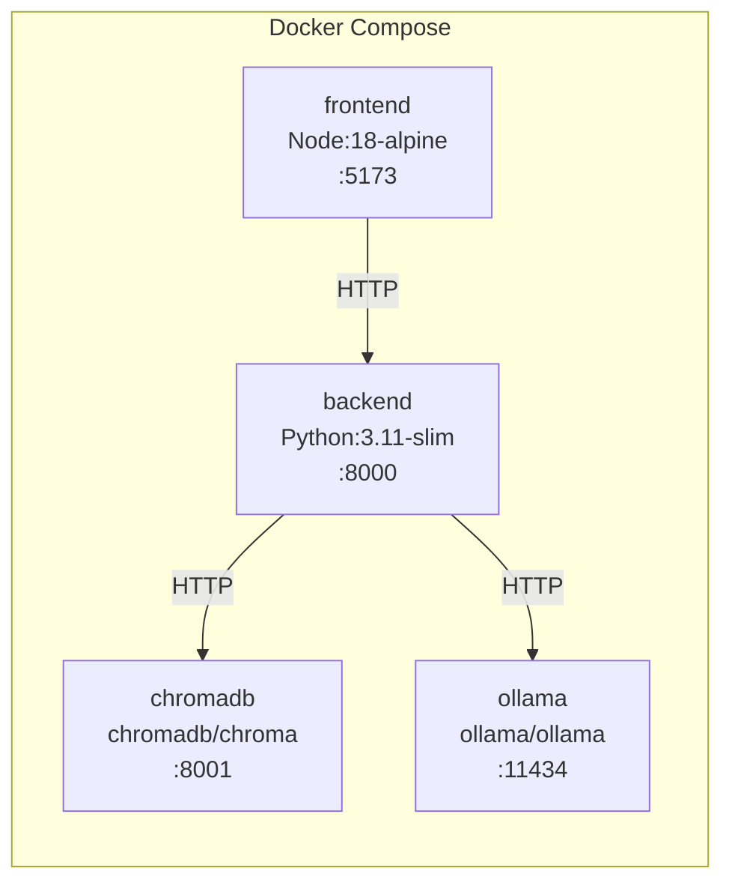

# 15 — Deployment

> **Document Status:** Initial Draft
> **Last Updated:** Phase 0

---

## 1. Overview

SEAM is deployed using Docker Compose for reproducible, containerised
execution. This document describes the deployment architecture and procedures.

## 2. Deployment Architecture



## 3. Docker Services

### 3.1 Backend

```dockerfile
# deployment/Dockerfile.backend
FROM python:3.11-slim
WORKDIR /app
COPY requirements.txt .
RUN pip install --no-cache-dir -r requirements.txt
COPY . .
EXPOSE 8000
CMD ["uvicorn", "backend.main:app", "--host", "0.0.0.0", "--port", "8000"]
```

### 3.2 Frontend

```dockerfile
# deployment/Dockerfile.frontend
FROM node:18-alpine AS build
WORKDIR /app
COPY frontend/package*.json ./
RUN npm ci
COPY frontend/ .
RUN npm run build

FROM nginx:alpine
COPY --from=build /app/dist /usr/share/nginx/html
EXPOSE 5173
```

### 3.3 Docker Compose

```yaml
# deployment/docker-compose.yml
version: '3.8'
services:
  backend:
    build:
      context: ..
      dockerfile: deployment/Dockerfile.backend
    ports:
      - "8000:8000"
    env_file:
      - ../.env
    depends_on:
      - chromadb
      - ollama

  frontend:
    build:
      context: ..
      dockerfile: deployment/Dockerfile.frontend
    ports:
      - "5173:80"
    depends_on:
      - backend

  chromadb:
    image: chromadb/chroma:latest
    ports:
      - "8001:8000"
    volumes:
      - chroma_data:/chroma/chroma

  ollama:
    image: ollama/ollama:latest
    ports:
      - "11434:11434"
    volumes:
      - ollama_data:/root/.ollama

volumes:
  chroma_data:
  ollama_data:
```

## 4. Deployment Procedure

### 4.1 Development (Local)

```bash
# Start all services
cd deployment
docker-compose up -d

# Pull required models (first time only)
docker exec -it seam-ollama-1 ollama pull deepseek-coder
docker exec -it seam-ollama-1 ollama pull llama3.1

# View logs
docker-compose logs -f backend
```

### 4.2 Stopping

```bash
docker-compose down
```

### 4.3 Cleanup

```bash
docker-compose down -v  # removes volumes too
```

## 5. Environment-Specific Configuration

| Variable | Development | Demonstration |
|----------|------------|---------------|
| `DEBUG` | `true` | `false` |
| `LOG_LEVEL` | `DEBUG` | `INFO` |
| `BACKEND_RELOAD` | `true` | `false` |

## 6. Deployment Directory Structure

```
deployment/
├── README.md
├── Dockerfile.backend
├── Dockerfile.frontend
├── docker-compose.yml
├── docker-compose.override.yml  (local overrides, gitignored)
└── nginx.conf                   (frontend reverse proxy config)
```

## 7. Prerequisites for Deployment

- Docker Engine 20.10+
- Docker Compose v2
- Sufficient system resources:
  - RAM: ≥ 16 GB recommended (Ollama models are memory-intensive)
  - Disk: ≥ 20 GB for model storage
  - GPU: Optional but recommended for faster inference
